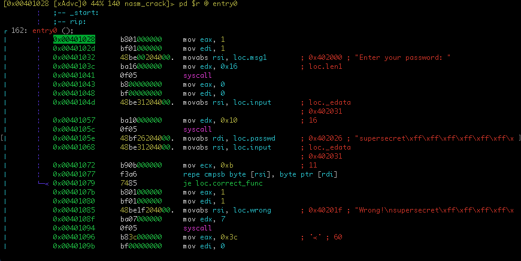

# Solution for BitFriends' nasm crack
mara <mara@localhost.local>

## Analysis

The goal will find the "correct" message and it's a 64 bits program..

Take `radare2`[^1], to analyze the binary.

NOTE: please use the `git` version of `radare2` to be up to date

```bash
$ r2 nasm_crack
 -- git blind --hard
[0x00401028]>
```

Don't forget, use `aaa` option to disassemble the crackme.
The entry point with Cutter is named by a _flag_ `entry0`

NOTE: a flag is a litteral or a identifier in a `radare` jargon

```bash
[0x00401028]> aaa
[x] Analyze all flags starting with sym. and entry0 (aa)
[x] Analyze function calls (aac)
[x] Analyze len bytes of instructions for references (aar)
[x] Check for objc references
[x] Check for vtables
[x] Type matching analysis for all functions (aaft)
[x] Propagate noreturn information
[x] Use -AA or aaaa to perform additional experimental analysis.
[0x00401028]>
```

To navigate efficiently in the code, we can use `Vp` command.

```bash
[0x00401028]> Vp
```

> **TIP:**  we can navigate with `arrow` keys or `h`,
`j`, `k`, `l` keys like in VIM text editor.



According to linux-x64-syscall-table[^2], the code between 0x401028 and
0x401041, print the message _"Enter your password: "._

Add a comment at 0x401041, by pressing `;` key an validate it by `enter`/`return` key.


The code between 0x401043 and 0x40105c, grab the user entry.

The user entry string will be a length of 16 characters.


The code between 0x40105e and 0x401077 compare the content of
address pointed by rsi and rdi until ecx will be equals to zero or
a characters is different during the loop iteration.
If all characters are equals the je nmemonic at 0x401079 will be
taken.


To jump, on this line, press `enter`/`return` key to jump at loc.correct_fun


> **TIP:** to return before the jump press the `u` key.

Great, if so the answer is the value pointed by rdi, so `loc.passwd`.

The right value is *supersecret*.


[^2]: https://blog.rchapman.org/posts/Linux_System_Call_Table_for_x86_64/

[^1]: https://rada.re
