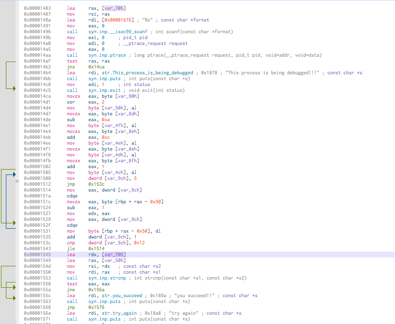

# Solution for zed-zahir's ZED-Crackme
mara <mara@localhost.local>

## Analysis

Before all, unpack the binary via `upx`[^1].

```bash
$ upx -d ZED-Crackme-x64.bin
```

The goal will find the good serial.

Take Cutter[^2], to analyze the binary.

Don't forget, use `aaa` option to disassemble the crackme.
The entry point with Cutter is named by a _flag_ `entry0`

> **NOTE:** a flag is a litteral or a identifier in a Cutter jargon

```assembly
  ;-- section..text:
  ;-- .text:
  ;-- _start:
42: entry0 (int64_t arg3);
; arg int64_t arg3 @ rdx
0x000008c0      xor     ebp, ebp   ; [14] -r-x section size 3410 named .text
0x000008c2      mov     r9, rdx    ; arg3
0x000008c5      pop     rsi
0x000008c6      mov     rdx, rsp
0x000008c9      and     rsp, 0xfffffffffffffff0
0x000008cd      push    rax
0x000008ce      push    rsp
0x000008cf      lea     r8, [sym.__libc_csu_fini] ; 0x1610
0x000008d6      lea     rcx, [sym.__libc_csu_init] ; 0x15a0 ; "AWAVI\x89\xd7AUATL\x8d%\xae\a "
0x000008dd      lea     rdi, [main] ; sym.main
                                   ; 0x1343
0x000008e4      call    qword [reloc.__libc_start_main] ; 0x201fe0
```

It's the classical startup sequence for a Linux program.
Look the assembly at `sym.main` :

```assembly
int main (int argc, char **argv, char **envp);
; var int64_t var_b0h @ rbp-0xb0
; var int64_t var_a4h @ rbp-0xa4
; var int64_t var_9ch @ rbp-0x9c
; var int64_t var_91h @ rbp-0x91
; var int64_t var_90h @ rbp-0x90
; var int64_t var_8fh @ rbp-0x8f
; var int64_t var_8eh @ rbp-0x8e
; var int64_t var_8dh @ rbp-0x8d
; var int64_t var_88h @ rbp-0x88
; var int64_t var_80h @ rbp-0x80
; var int64_t var_7eh @ rbp-0x7e
; var int64_t var_70h @ rbp-0x70
; var int64_t var_50h @ rbp-0x50
; var int64_t var_4fh @ rbp-0x4f
; var int64_t var_4eh @ rbp-0x4e
; var int64_t var_4dh @ rbp-0x4d
; var int64_t var_4ch @ rbp-0x4c
; var int64_t var_30h @ rbp-0x30
; var int64_t var_28h @ rbp-0x28
; var int64_t var_20h @ rbp-0x20
; var int64_t var_18h @ rbp-0x18
; var int64_t var_10h @ rbp-0x10
; var int64_t var_eh @ rbp-0xe
; var int64_t var_8h @ rbp-0x8
; arg int argc @ rdi
; arg char **argv @ rsi
0x00001343      push    rbp
0x00001344      mov     rbp, rsp
0x00001347      sub     rsp, 0xb0
0x0000134e      mov     dword [var_a4h], edi ; argc
0x00001354      mov     qword [var_b0h], rsi ; argv
0x0000135b      mov     rax, qword fs:[0x28]
0x00001364      mov     qword [var_8h], rax
0x00001368      xor     eax, eax
0x0000136a      lea     rdi, str.  ; 0x17dd ; "***********************" ; const char *s
0x00001371      call    sym.imp.puts ; int puts(const char *s)
0x00001376      lea     rdi, str.rules: ; 0x17f5 ; "**      rules:       **" ; const char *s
0x0000137d      call    sym.imp.puts ; int puts(const char *s)
0x00001382      lea     rdi, str.  ; 0x17dd ; "***********************" ; const char *s
0x00001389      call    sym.imp.puts ; int puts(const char *s)
0x0000138e      mov     edi, 0xa   ; int c
0x00001393      call    sym.imp.putchar ; int putchar(int c)
0x00001398      lea     rdi, str.do_not_bruteforce ; 0x180d ; "* do not bruteforce" ; const char *s
0x0000139f      call    sym.imp.puts ; int puts(const char *s)
0x000013a4      lea     rdi, str.do_not_patch__find_instead_the_serial. ; 0x1828 ; "* do not patch, find instead the serial." ; const char *s
0x000013ab      call    sym.imp.puts ; int puts(const char *s)
0x000013b0      mov     edi, 0xa   ; int c
0x000013b5      call    sym.imp.putchar ; int putchar(int c)
```

Here, zed-zahir print the crackme banner, but later in the code some interesting stuff will be discovered.

```assembly
0x000013fc      sidt    [rbp - 0x96]
0x00001403      movzx   eax, byte [var_91h]
0x0000140a      cmp     al, 0xff
0x0000140c      jne     0x1424
0x0000140e      lea     rdi, str.VMware_detected ; 0x1851 ; "VMware detected" ; const char *s
0x00001415      call    sym.imp.puts ; int puts(const char *s)
0x0000141a      mov     edi, 1     ; int status
0x0000141f      call    sym.imp.exit ; void exit(int status)
```

The first one is an anti vmware by `sidt` nmemonic... well-known unless if I mistaken red-pill[^3] . Another interesting article that threat about of protection ultimate-anti-reversing[^4].

```assembly
0x0000149b      mov     esi, 0     ; pid_t pid
0x000014a0      mov     edi, 0     ; __ptrace_request request
0x000014a5      mov     eax, 0
0x000014aa      call    sym.imp.ptrace ; long ptrace(__ptrace_request request, pid_t pid, void*addr, void*data)
0x000014af      test    rax, rax
0x000014b2      jns     0x14ca
0x000014b4      lea     rdi, str.This_process_is_being_debugged ; 0x1878 ; "This process is being debugged!!!" ; const char *s
0x000014bb      call    sym.imp.puts ; int puts(const char *s)
0x000014c0      mov     edi, 1     ; int status
0x000014c5      call    sym.imp.exit ; void exit(int status)
```

Voila, the second one detect if an debugger is attached via `ptrace` function.


```assembly
0x00001545      lea     rdx, [var_70h]
0x00001549      lea     rax, [var_50h]
0x0000154d      mov     rsi, rdx   ; const char *s2
0x00001550      mov     rdi, rax   ; const char *s1
0x00001553      call    sym.imp.strcmp ; int strcmp(const char *s1, const char *s2)
0x00001558      test    eax, eax
0x0000155a      jne     0x156a
0x0000155c      lea     rdi, str.you_succeed ; 0x189a ; "you succeed!!" ; const char *s
0x00001563      call    sym.imp.puts ; int puts(const char *s)
0x00001568      jmp     0x1576
0x0000156a      lea     rdi, str.try_again ; 0x18a8 ; "try again" ; const char *s
0x00001571      call    sym.imp.puts ; int puts(const char *s)
0x00001576      mov     eax, 0
```

The `strcmp` compare two values from [var_70h] and [var_50h].
 `Cutter` is able to highlight the values usage. Here, click on the value [var_70h].
 


[var_70h] seems used twice at 0x00001545 and 0x00001483 directly.

At 0x00001483, [var_70h] moved in rax then rsi.

To conclude, the `strcmp`
function take the contents without alteration.
[var_70h] is the user value.

So [var_50h], by deduction is the correct value to find.

I don't want trace the code step by step.
The first strategy will use the Cutter code emulation.
But the quick and the good strategy will be to inspect the content of [var_70h] and [var_50h] via *LD_PRELOAD* tricks.

```c
int strcmp(const char *s, const char *s2) {
	printf("s1 %s\ns2 %s", s, s2);
	return 0;
}
```

The idea behind *LD_PRELOAD* tricks is hooking the real function by our library.
`strcmp` hooked but before, the c code must be compiled. Here, the program is `m.c`

```bash
$ gcc -shared -fPIC m.c -o m.so
```

To inject m.so at the execution of ZED Crackme, type the following command :

```bash
$ LD_PRELOAD=./m.so ./ZED-Crackme-x64.bin
```

Enter a dummy password *okokok*.

```
***********************
**      rules:       **
***********************

* do not bruteforce
* do not patch, find instead the serial.

enter the passphrase: s1 C(uiICD@CADDEBNEEDD
s2 okokokyou succeed!!
```

The password printed. It's *C(uiICD@CADDEBNEEDD*
Now, you can run the program and check the flag !

```
***********************
**      rules:       **
***********************

* do not bruteforce
* do not patch, find instead the serial.

enter the passphrase: you succeed!!
```
Great !


[^1]: https://upx.github.io

[^2]: https://cutter.re

[^3]: https://www.lions.odu.edu/~c1wang/course/cs495/lecture/10_2_Anti-VM_Techniques.pdf

[^4]: https://anti-reversing.com/Downloads/Anti-Reversing/The_Ultimate_Anti-Reversing_Reference.pdf
